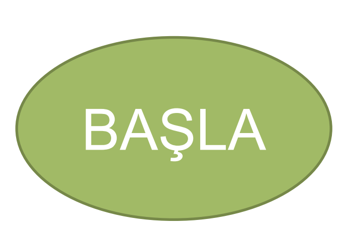
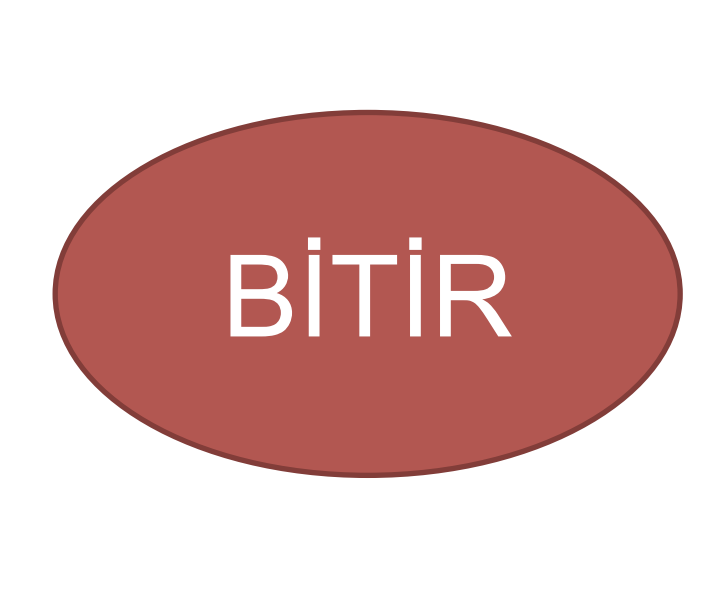
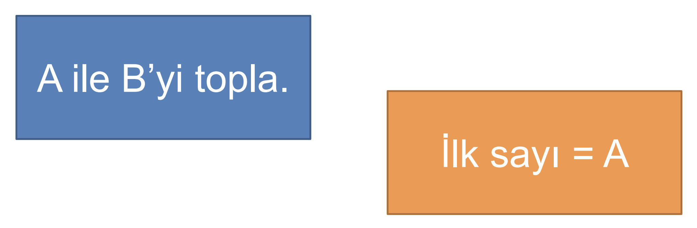
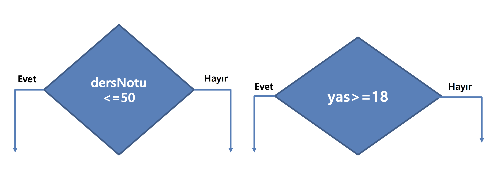
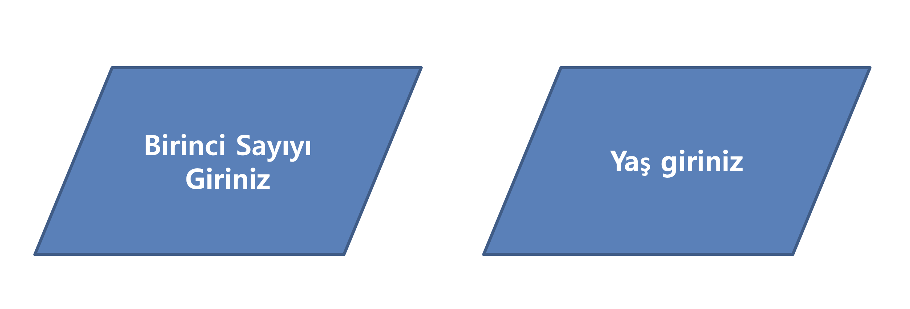

# Hafta 1

## Haftanın Özeti
- Algoritmanın Tanımı
- Etimoloji ve Tarihçe
- Algoritma ve Program Arasındaki Fark
- Algoritmanın Önemi
- Algoritma Yazma Kuralları
- Akış Şemaları

## İçerik
### Algoritmanın Tanımı

Algoritma, belirli bir problemi çözmek veya belirli bir işlemi gerçekleştirmek için tasarlanan yol veya yöntemdir. Algoritmalar, adım adım açıklanan ve belirli bir girdi alarak belirli bir çıktı üreten talimatlar dizisidir.

### Etimoloji ve Tarihçe

Algoritma kelimesi, İslam matematikçisi Harzem Türkü olan Muhammed bin Musa el-Harezmi'nin adından gelmektedir. Harzemli Muhammed, 9. yüzyılda yaşamış ve matematik, astronomi ve coğrafya alanlarında çalışmıştır. Harzemli Muhammed, "Al-Khwarizmi" adlı kitabında cebir ve hesaplama tekniklerini açıklamıştır. Bu kitap, "Algoritmi" kelimesinin kökeni olmuştur.

### Algoritma ve Program Arasındaki Fark

Algoritma, belirli bir problemi çözmek için tasarlanan yol veya yöntemdir. Program ise bu algoritmanın belirli bir programlama diline göre yazılmış halidir. Yani algoritma, genel bir çözüm yolu iken program, bu çözüm yolunun belirli bir programlama diline göre yazılmış halidir.

### Programlamada Algoritmanın Önemi

Algoritma, programlama alanında temel bir kavramdır. İyi bir algoritma, verimli ve hızlı bir programın temelidir. Algoritma, bir problemi çözmek için tasarlanan yol olduğu için, iyi bir algoritma yazmak, programın daha hızlı ve verimli çalışmasını sağlar.

### Algoritma Yazma Kuralları

Algoritma yazarken dikkat edilmesi gereken bazı kurallar vardır. Bu kurallar, algoritmanın daha anlaşılır ve okunabilir olmasını sağlar. Algoritma yazma kurallarından bazıları şunlardır:

- Algoritma, belirli bir problemi çözmek için tasarlanmalıdır.
- Algoritma, adım adım açıklanmalıdır.
- Algoritma, belirli bir girdi almalı ve belirli bir çıktı üretmelidir.
- Algoritma, sonlu ve açıklayıcı olmalıdır.
- Algoritma, başlangıç ve bitiş noktalarına sahip olmalıdır.
- Algoritma, genel bir çözüm yolu olmalıdır.
- Algoritma, belirli bir programlama diline göre yazılmamalıdır.
- Algoritma, anlaşılır ve okunabilir olmalıdır.
- Algoritma, test edilmelidir.

### Akış Şemaları

Akış şemaları, algoritmaların görsel olarak temsil edilmesi için kullanılan diyagramlardır. Akış şemaları, algoritmanın adım adım nasıl çalıştığını gösteren diyagramlardır. Akış şemaları, algoritmaların daha iyi anlaşılmasını sağlar ve algoritmaların hatalarının tespit edilmesine yardımcı olur.

Akış şemasındaki temel elemanlar şunlardır:

- Başlangıç ve Bitiş Noktaları

  

- İşlem (Process)

- Karar (Decision)

- Çıktı (Output)

- Girdi (Input)

- Döngü (Loop)

